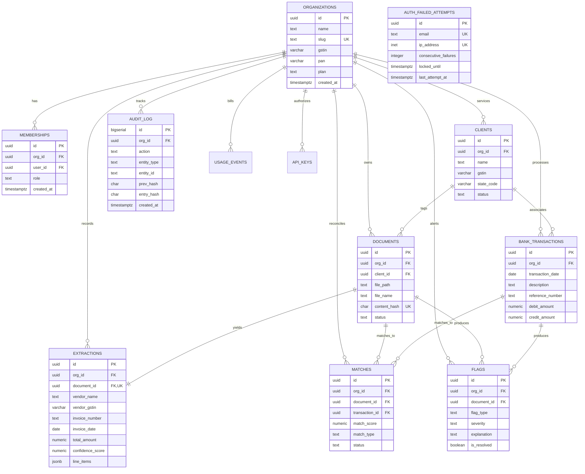

# Galuxium Nexus V2: Entity-Relationship Diagram (ERD)

```mermaid
erDiagram
    ORGANIZATIONS ||--o{ MEMBERSHIPS : has
    ORGANIZATIONS ||--o{ CLIENTS : services
    ORGANIZATIONS ||--o{ DOCUMENTS : owns
    ORGANIZATIONS ||--o{ EXTRACTIONS : records
    ORGANIZATIONS ||--o{ BANK_TRANSACTIONS : processes
    ORGANIZATIONS ||--o{ MATCHES : reconciles
    ORGANIZATIONS ||--o{ FLAGS : alerts
    ORGANIZATIONS ||--o{ AUDIT_LOG : tracks
    ORGANIZATIONS ||--o{ USAGE_EVENTS : bills
    ORGANIZATIONS ||--o{ API_KEYS : authorizes

    CLIENTS ||--o{ DOCUMENTS : tags
    CLIENTS ||--o{ BANK_TRANSACTIONS : associates

    DOCUMENTS ||--|| EXTRACTIONS : yields
    DOCUMENTS ||--o{ MATCHES : matches_to
    DOCUMENTS ||--o{ FLAGS : produces

    BANK_TRANSACTIONS ||--o{ MATCHES : matches_to
    BANK_TRANSACTIONS ||--o{ FLAGS : produces

    ORGANIZATIONS {
        uuid id PK
        text name
        text slug UK
        varchar gstin
        varchar pan
        text plan
        timestamptz created_at
    }

    MEMBERSHIPS {
        uuid id PK
        uuid org_id FK
        uuid user_id FK
        text role
        timestamptz created_at
    }

    CLIENTS {
        uuid id PK
        uuid org_id FK
        text name
        varchar gstin
        varchar state_code
        text status
    }

    DOCUMENTS {
        uuid id PK
        uuid org_id FK
        uuid client_id FK
        text file_path
        text file_name
        char content_hash UK
        text status
    }

    EXTRACTIONS {
        uuid id PK
        uuid org_id FK
        uuid document_id FK,UK
        text vendor_name
        varchar vendor_gstin
        text invoice_number
        date invoice_date
        numeric total_amount
        numeric confidence_score
        jsonb line_items
    }

    BANK_TRANSACTIONS {
        uuid id PK
        uuid org_id FK
        date transaction_date
        text description
        text reference_number
        numeric debit_amount
        numeric credit_amount
    }

    MATCHES {
        uuid id PK
        uuid org_id FK
        uuid document_id FK
        uuid transaction_id FK
        numeric match_score
        text match_type
        text status
    }

    FLAGS {
        uuid id PK
        uuid org_id FK
        uuid document_id FK
        text flag_type
        text severity
        text explanation
        boolean is_resolved
    }

    AUDIT_LOG {
        bigserial id PK
        uuid org_id FK
        text action
        text entity_type
        text entity_id
        char prev_hash
        char entry_hash
        timestamptz created_at
    }

    AUTH_FAILED_ATTEMPTS {
        uuid id PK
        text email UK
        inet ip_address UK
        integer consecutive_failures
        timestamptz locked_until
        timestamptz last_attempt_at
    }
```
